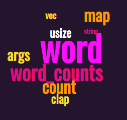

# word-stat

Output the individual word-count statistics from a set of files, or generate a curated word list for
use on e.g. https://monkeylearn.com/word-cloud.

## Example:

```shell
fd .rs | xargs word-stat stats -t 10
```
### Output:

```shell
Total words: 113
word    24      21.24
word_counts     13      11.50
let     11      9.73
count   11      9.73
map     11      9.73
args    10      8.85
clap    9       7.96
usize   9       7.96
Vec     8       7.08
pub     7       6.19
```

Using `fd .rs | xargs word-stat words -t 10`, the output can be used directly to generate art like this:

